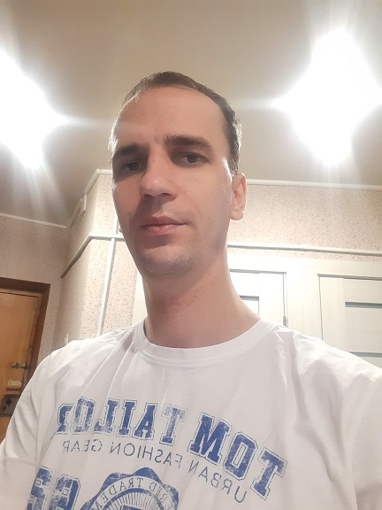

# Aliaksandr Hrabiankou




## Contacts:   

phone number: +375 (33) 672-71-91 (preferred means of communication)

email: picccc89@gmail.com 


## About me:

I was doing programming at home as a hobby, I wanted to try in commercial development. My github:  https://github.com/troay89


## Competencies and key skills:

- Technology Stack Application/Digital Skills:
    - Git
    - Java
    - SE
    - OOP
    - Clean architecture
    - SQLite
    - MVVM
    - Gradle
- Programming languages
    - kotlin
    - java
- Other
    - room
    - androidx
    - picasso
    - fragment
    - RecyclerView
    - coroutine
    - retrofit2
    - material
    - Hilt
    - Koin
    - Navigation component
    - Paging


## Code example:

```java
package com.example.showcat.ui.mapper

import com.example.showcat.core.BaseMapper
import com.example.showcat.domain.model.CatEntity
import com.example.showcat.ui.model.CatUI

object EntityToUI: BaseMapper<CatEntity, CatUI> {
    override fun map(type: CatEntity?): CatUI {
        return CatUI(
            id = type!!.id,
            imageUrl = type.url
        )
    }
}
```

## My home projects:

[project shows cats ;)](https://github.com/troay89/ShowCat)

[this is a simple note ](https://github.com/troay89/Notes)


## Secondary special education:

Orsha Lyceum of Processing Industry


## Professional development, courses:

2020  javarush


## Languages:

Russian - Native

English - A2 - Elementary